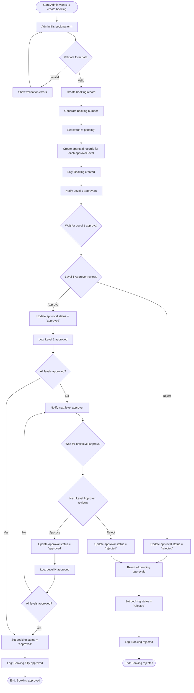
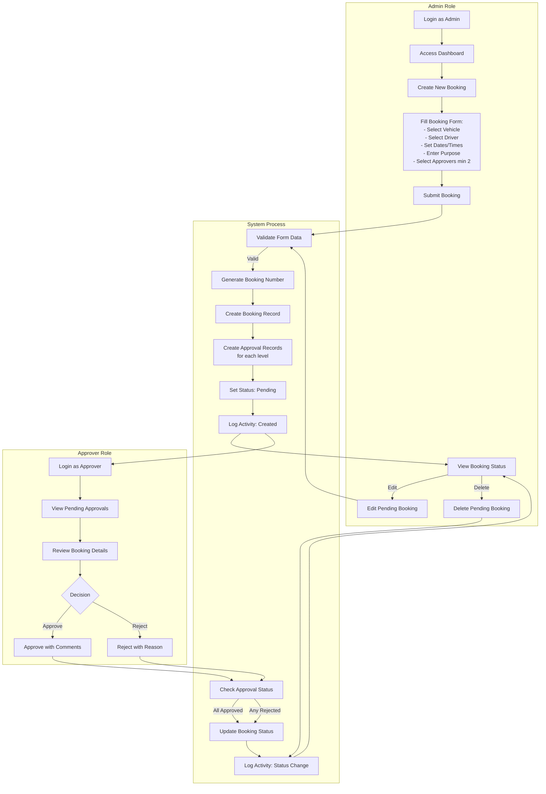
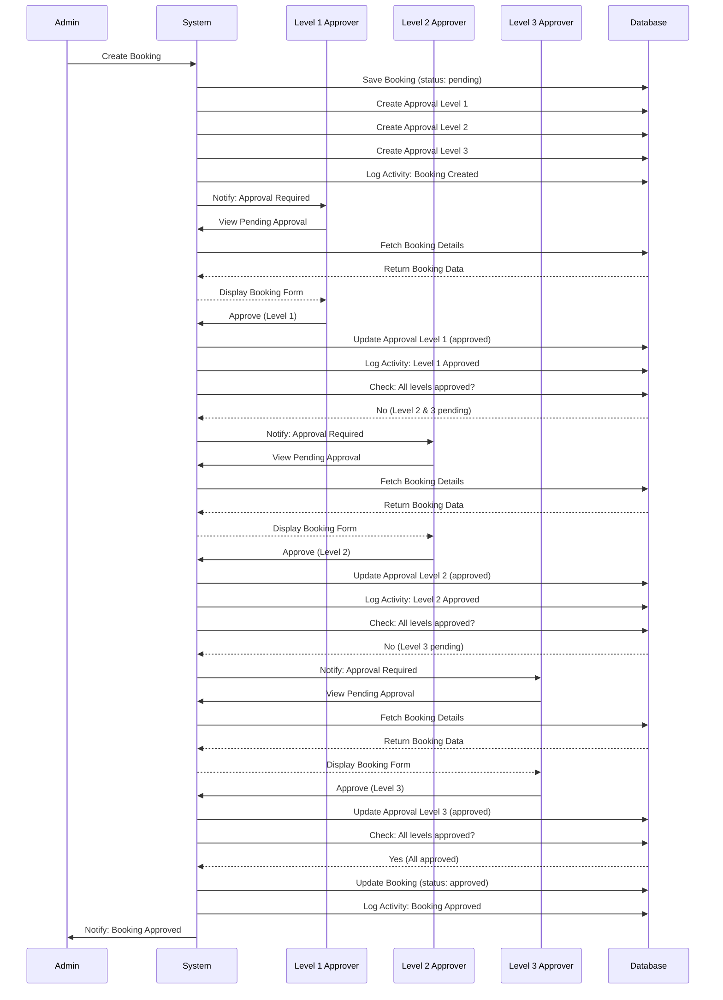
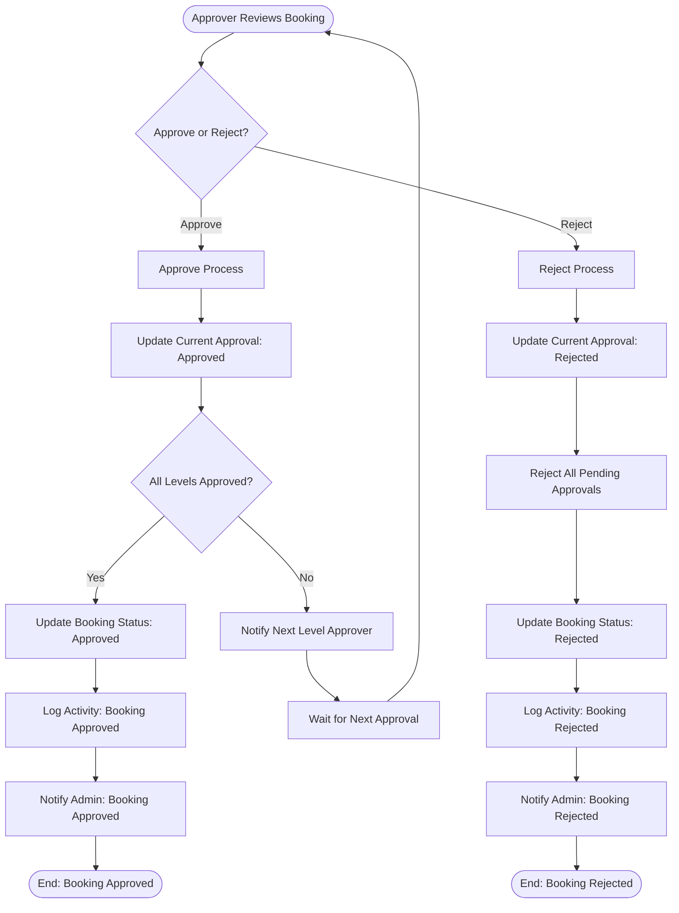

# Activity Diagram - Vehicle Booking Process

## Booking Process Flow

## Detailed Activity Diagram with Swimlanes

## Sequential Approval Process

## Rejection Flow

## Key Process Steps

### 1. Booking Creation (Admin)
- **Actor**: Admin
- **Actions**:
  1. Fill booking form
  2. Select vehicle
  3. Select driver
  4. Set date/time range
  5. Enter purpose and destination
  6. Select minimum 2 approvers
  7. Submit form
- **System Actions**:
  1. Validate input
  2. Generate unique booking number
  3. Create booking record (status: pending)
  4. Create approval records for each selected approver
  5. Log activity
  6. Notify approvers

### 2. Approval Process (Multi-Level)
- **Actor**: Approvers (Level 1, 2, 3, ...)
- **Actions**:
  1. View pending approvals assigned to them
  2. Review booking details
  3. Make decision (Approve/Reject)
  4. Add comments (optional for approve, required for reject)
  5. Submit decision
- **System Actions**:
  1. Update approval record
  2. Log activity
  3. Check if all levels approved
  4. If all approved: Update booking status to "approved"
  5. If rejected: Update booking status to "rejected" and reject all pending approvals
  6. If not all approved: Notify next level approver

### 3. Status Transitions
- **Pending** → **Approved** (when all approval levels approve)
- **Pending** → **Rejected** (when any approval level rejects)
- **Pending** → **Pending** (can be edited by admin)
- **Approved/Rejected** → Cannot be edited or deleted

### 4. Activity Logging
All actions are logged with:
- User who performed action
- Action type (created, updated, approved, rejected, deleted)
- Model type and ID
- Old and new values (for updates)
- Timestamp
- IP address and user agent

## Business Rules

1. **Minimum Approvers**: At least 2 approvers must be selected
2. **Sequential Approval**: Approvals are processed by level (1, 2, 3, ...)
3. **All or Nothing**: All levels must approve for final approval
4. **Rejection Cascade**: Any rejection rejects the entire booking
5. **Edit Restriction**: Only pending bookings can be edited
6. **Delete Restriction**: Only pending bookings can be deleted
7. **Date Validation**: End date must be after or equal to start date
8. **Time Validation**: Start time and end time must be valid

