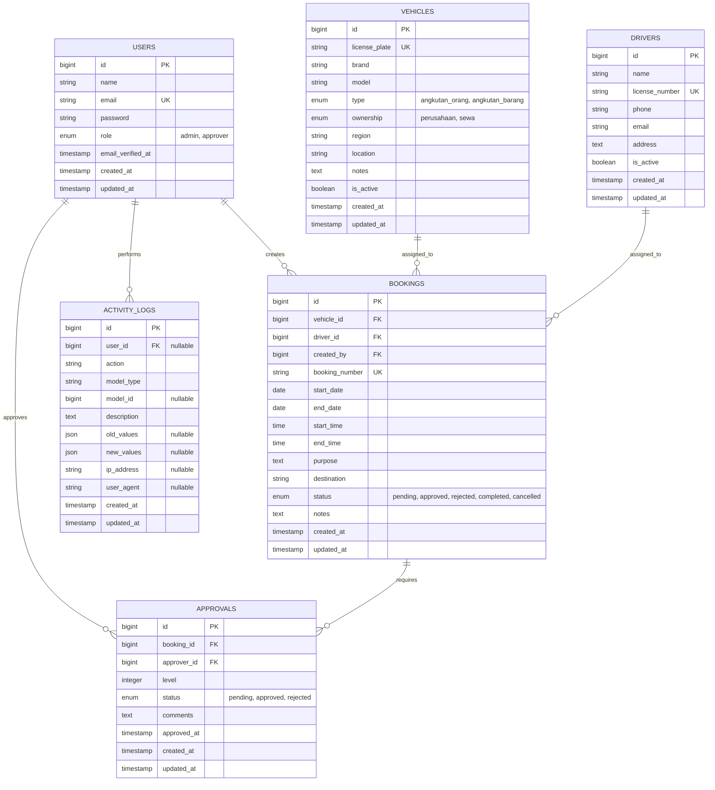

# Physical Data Model Diagram

## Entity Relationship Diagram



## Table Relationships

### Primary Keys (PK)
- All tables have an `id` column as primary key
- `users.email` is unique
- `vehicles.license_plate` is unique
- `drivers.license_number` is unique
- `bookings.booking_number` is unique

### Foreign Keys (FK)
- `bookings.vehicle_id` → `vehicles.id`
- `bookings.driver_id` → `drivers.id`
- `bookings.created_by` → `users.id`
- `approvals.booking_id` → `bookings.id`
- `approvals.approver_id` → `users.id`
- `activity_logs.user_id` → `users.id`

### Relationships

1. **Users → Bookings** (One-to-Many)
   - One user can create many bookings
   - Foreign key: `bookings.created_by`

2. **Users → Approvals** (One-to-Many)
   - One user can approve many bookings
   - Foreign key: `approvals.approver_id`

3. **Users → Activity Logs** (One-to-Many)
   - One user can have many activity logs
   - Foreign key: `activity_logs.user_id` (nullable)

4. **Vehicles → Bookings** (One-to-Many)
   - One vehicle can be used in many bookings
   - Foreign key: `bookings.vehicle_id`

5. **Drivers → Bookings** (One-to-Many)
   - One driver can be assigned to many bookings
   - Foreign key: `bookings.driver_id`

6. **Bookings → Approvals** (One-to-Many)
   - One booking requires multiple approvals (multi-level)
   - Foreign key: `approvals.booking_id`

## Indexes

### Recommended Indexes for Performance

```sql
-- Users table
CREATE INDEX idx_users_role ON users(role);
CREATE INDEX idx_users_email ON users(email);

-- Vehicles table
CREATE INDEX idx_vehicles_is_active ON vehicles(is_active);
CREATE INDEX idx_vehicles_type ON vehicles(type);

-- Drivers table
CREATE INDEX idx_drivers_is_active ON drivers(is_active);

-- Bookings table
CREATE INDEX idx_bookings_vehicle_id ON bookings(vehicle_id);
CREATE INDEX idx_bookings_driver_id ON bookings(driver_id);
CREATE INDEX idx_bookings_created_by ON bookings(created_by);
CREATE INDEX idx_bookings_status ON bookings(status);
CREATE INDEX idx_bookings_start_date ON bookings(start_date);
CREATE INDEX idx_bookings_end_date ON bookings(end_date);
CREATE INDEX idx_bookings_booking_number ON bookings(booking_number);

-- Approvals table
CREATE INDEX idx_approvals_booking_id ON approvals(booking_id);
CREATE INDEX idx_approvals_approver_id ON approvals(approver_id);
CREATE INDEX idx_approvals_status ON approvals(status);
CREATE INDEX idx_approvals_level ON approvals(level);

-- Activity Logs table
CREATE INDEX idx_activity_logs_user_id ON activity_logs(user_id);
CREATE INDEX idx_activity_logs_model_type_model_id ON activity_logs(model_type, model_id);
CREATE INDEX idx_activity_logs_created_at ON activity_logs(created_at);
```

## Data Types Summary

| Table | Key Columns | Data Types |
|-------|------------|------------|
| users | id, email, role | bigint, string, enum |
| vehicles | id, license_plate, type, ownership | bigint, string, enum |
| drivers | id, license_number | bigint, string |
| bookings | id, booking_number, status, dates | bigint, string, enum, date, time |
| approvals | id, booking_id, approver_id, level, status | bigint, bigint, bigint, integer, enum |
| activity_logs | id, user_id, model_type, model_id | bigint, bigint, string, bigint |

## Constraints

1. **Check Constraints:**
   - `bookings.end_date >= bookings.start_date`
   - `approvals.level >= 1`
   - `bookings.status` must be one of: pending, approved, rejected, completed, cancelled
   - `approvals.status` must be one of: pending, approved, rejected

2. **Cascade Rules:**
   - Deleting a booking cascades to delete all related approvals
   - Deleting a vehicle/driver sets foreign keys to null (if allowed) or prevents deletion if bookings exist
   - Activity logs are preserved even if user is deleted (user_id can be null)

